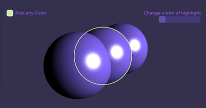

# Babylon.js Project with Vite


Welcome to my Babylon.js project! This project showcases the power of Babylon.js for creating stunning 3D experiences(esp with custom shaders). With node as our local development server, you can easily get started and run this project on your own machine.


## Getting Started

Follow these steps to run the project on your machine:

### Prerequisites

Make sure you have the following software installed on your machine:
- [Node.js](https://nodejs.org/) (v14 or higher)
- [npm](https://www.npmjs.com/get-npm)
### Installation

1. Clone this repository to your local machine via Terminal
```bash
git clone https://github.com/DebajyotiX/hoverGlowMania.git
```

Navigate to the project folder:
```bash
cd hoverGlowMania
```
  

Install Vite and BabylonJS using `npm`:
```bash
npm install vite
npm install -D @babylonjs/core
```

Running the Development Server
Start the development server using the following command:
```bash
npm run dev  
```

Once the development server is set up, node will host the project in a port in your own local machine. It will provide a http link, for example `http://localhost:8000` or `http://localhost:5170`.

Open your web browser and go to respective `http://localhost:XXXX `to see the Babylon.js project in action!

  

## Project Structure

`main.js` creates scene, implements the features in the requirement

`src/` contains the source code of js functions used by main.js

`package.json` lists the project dependencies and scripts.

`asset/` contains font file

`meshHighlight.fragment.fx` Contains the fragment shader that outlines. It uses fresnel effect, and calculates whether the pixel's world-normal is at a grazing angle from the camera. If its within a certain threshold, it colours it differently than the rest of the material. It also tweaks the z-buffer for that pixel, so that it renders infront of everyting else. 

`phong.fragment.fx` A custom phong shader, that emulates a light source. its the default shader when objects are not highlighted.

## Troubleshooting

If you encounter any issues while setting up or running the project, please check the following:

1. Ensure you have the required software and versions installed (Node.js and npm).
2. Double-check that you are running the correct commands from the project directory.


## Ideas
Babylon JS Library Implementation of outline is pretty good. 
1. add object to Highlight Layer -> OutlineRenderer


#### Some Interesting Alternative Algorithms
1. Reverse Hull Method(requires building a custom mesh modifier, similar to Blender's Solidify Modifier, that adds thickness to meshes). seems , there is no built in features in BablylonJS like that; so it requires creating one, with low-level advanced features of BabylonJS
2. Flood Fill algorithm(similar to fill color feature of MS Paint) (GPU Silhouette Rendering, computationally expensive)
3. Clone-Blur-mask method(requires post processing and re-renders)

Happy coding!💻